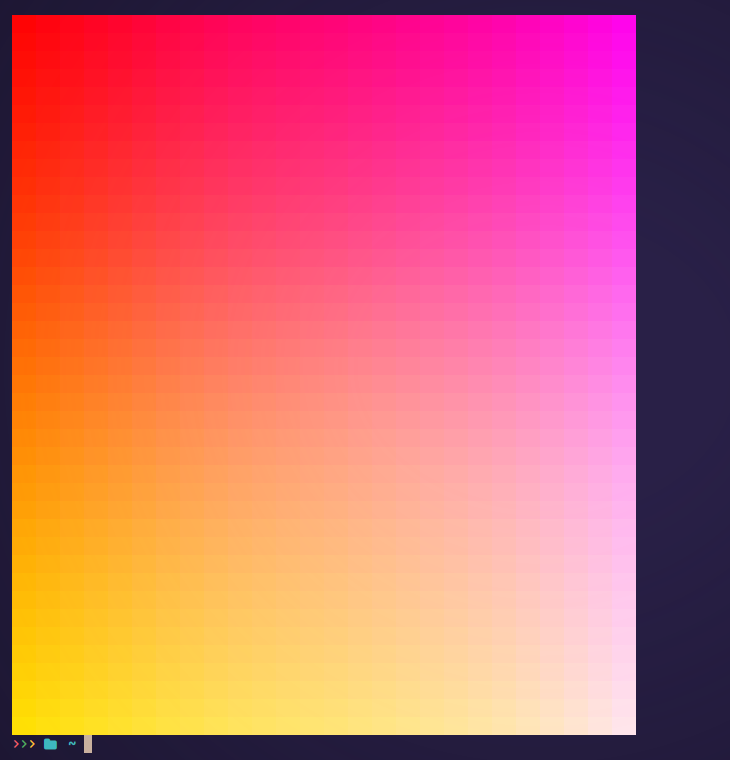

# Colorize
> A library for colorizing texts in terminal.

<h1 align="center">Demo</h1>
<p align="center" width=100%">
  
  &nbsp; &nbsp;
  
</p>

<br>

## Table of Contents

- [Supported Platforms](#supported-on)
- [Usage](#using-at-a-glance)
- [Described](#described)
- [Documentation](#documentation)

<br>

## Supported on

> - [x] Linux
> - [x] MacOS
> - [x] Windows  <sup>Terminal-Emulator Needed! <sup> Win-Terminals are crappy so, kinda working...</sup></sup>

<br>

# Using at a glance

### 24 BIT <sup>True Color</sup>
```C++
// 24 BIT provides a color set of 16,777,216 colors.
std::cout << Colorize::rich24<0xeb106f, 0x263640>("Hello World", {Beautifier::emphasis::BOLD}) << std::endl;
```
##### which gives


***

### 8 BIT <sup>0-255</sup>
```C++
// 8 BIT provides a color set of 0-255 colors.
std::cout << Colorize::rich<199, 253>("Hello World", {Beautifier::emphasis::BOLD}) << std::endl;
```
##### which gives


<br>

# Described

### 24 BIT <sup>True Color</sup>
```CPP
std::cout <<

  Colorize::rich24<
            0xeb106f /* Foreground-Color : Hex */,
            0x263640 /* Background-Color : Hex */
            >
            ("Hello World" /* Text : std::string */,
            {
                // Styles : Beautifier::emphasis
                Beautifier::emphasis::BOLD
            }
            )

<< std::endl;
```

<br>

### 8 BIT <sup>0-255</sup>
```CPP
std::cout <<

  Colorize::rich<
            199 /* Foreground-Color : ColorCode */,
            253 /* Background-Color : ColorCode */
            >
            ("Hello World" /* Text : std::string */,
            {
                // Styles : Beautifier::emphasis
                Beautifier::emphasis::BOLD
            }
            )

<< std::endl;
```
