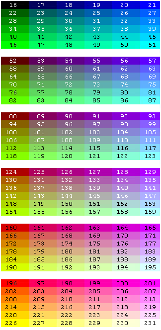
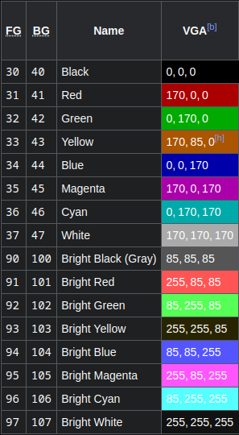

## Table of Contents

- [Brief discussion](#brief-discussion)
- [Usage](#using-at-a-glance)
- [Described](#described)
- [Installation](#installation)
- [References](#references)

 

# Brief Discussion

Colorize provides you with 3 ways of colorizing texts.

1. [**24 BIT**](#24-bit-or-true-color)
2. [**8 BIT**](#8-bit)
3. [**3/4 BIT**](#34-bit)

# 24 BIT or True Color
Modern OSs (`e.g. MacOS, Linux`) and Terminal Enulators (`e.g. Alacritty, Secure ShellFish, Blink Shell, KDE Konsole, etc.`) can and do support True Coloring scheme, which consists of about 16 million colors.

<h3 align="center">True Color Palette</h3>

  

 

# 8 BIT
Mostly supported on any UNIX like OSs and Terminal Enulators.

<h3 align="center">8 Bit Color Palettes</h3>

  
  

 

# 3/4 BIT
This coloring scheme is supported on systems since 1980s so, yours mostly supports it too.

<h3 align="center">3/4 Bit Color Palettes</h3>
<h6 align="center">Note: Color names are a bit off, so this is just an example to give you the idea</h6>

  
  

 

# References
##### Full explanation at holly [**WikiPedia**](https://en.wikipedia.org/wiki/ANSI_escape_code)

## See also:
- [ANSI Escape Codes - Github](https://gist.github.com/fnky/458719343aabd01cfb17a3a4f7296797)
- [ANSI Escape Codes - StackOverflow](https://stackoverflow.com/questions/4842424/list-of-ansi-color-escape-sequences)
- [Color depth](https://en.wikipedia.org/wiki/Color_depth#True_color_.2824-bit.29)
- [Build your own Command Line with ANSI](http://www.lihaoyi.com/post/BuildyourownCommandLinewithANSIescapecodes.html)
- [Difference between color schemes](https://www.computerhope.com/issues/ch001557.htm)
